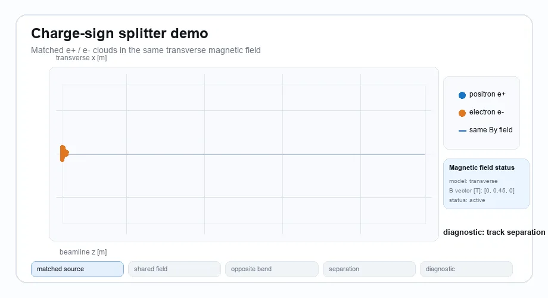
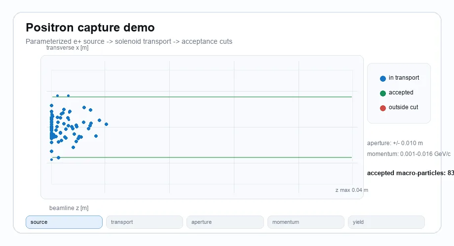
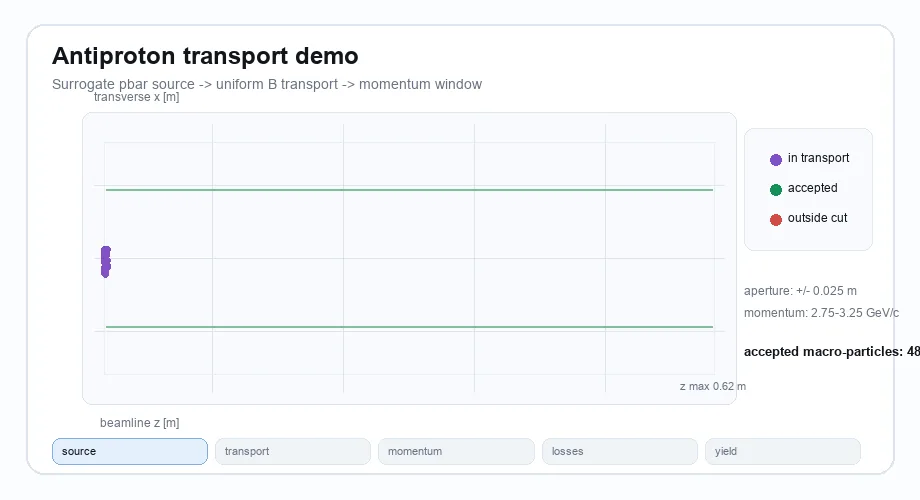
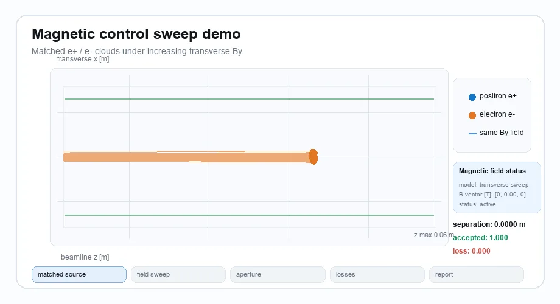

<p align="center">
  
</p>

# Latent Dirac

Latent Dirac is an open interactive simulation platform for antimatter
factories: declarative scenes of positron and antiproton facilities
(source → transport → capture), batch-parallel simulation and sweeps, and
interactive 3D visualization. The goal is to turn antimatter facility design
iteration from a wall-clock problem into a compute problem.

The platform is built on three pillars:

1. **Platform, not just a tracker** — declarative scene descriptions,
   pluggable solvers, and optional viewers on a shared data model.
2. **Throughput** — batched parameter sweeps designed for a JAX GPU backend
   (n_configs × n_particles in one launch).
3. **Ledger** — loss accounting as a full life-cycle ledger for every
   antiparticle, because antiparticles are extraordinarily expensive.

**Design intent vs current status.** The platform description above is what
Latent Dirac is architected for. The current release is a lightweight
NumPy-based Python core for source-to-acceptance modeling: fast scenario
modeling, parameter sweeps, transport studies, and acceptance accounting,
with placeholder adapters for future calibration against external scientific
tools such as Geant4 and Xsuite. GPU execution, the declarative scene
schema, and interactive 3D viewers are roadmap items, not shipped features.
See [docs/roadmap.md](docs/roadmap.md) for the phased plan.

## Fidelity Tiers

Every physics model in Latent Dirac declares one of five fidelity tiers:
**placeholder**, **parameterized**, **surrogate**, **table-based**, or
**externally calibrated**. Performance or physics claims in this repository
must reference reproducible settings, and comparative performance statements
require an open benchmark. Latent Dirac does not try to replace
high-fidelity particle-matter simulation tools; it orchestrates them through
adapters and stays honest about its own approximation level.

## Focus

- positron source term models
- antiproton surrogate source term models
- relativistic charged-particle transport in electromagnetic fields
- beamline acceptance
- loss accounting
- accepted-yield diagnostics
- optional visualization backends separated from the physics core

## Current Status

This repository contains the architecture skeleton and minimal working
simulation demos.

Implemented:

- SI-unit constants, unit conversions, and particle species
- `ParticleCloud` as the universal intermediate state
- parameterized positron pair source model
- simplified beta-plus positron source model
- surrogate antiproton source model
- uniform and idealized solenoid fields
- relativistic Boris transport
- aperture and momentum-window acceptance
- staged pipeline loss accounting
- accepted-yield and spectrum diagnostics
- optional Matplotlib and Plotly visualization backends
- placeholder adapters for Geant4, Xsuite, and ROOT

Not implemented yet:

- declarative scene schema and scene-driven 3D viewers
- JAX GPU backend and batched sweep API
- field-map import from external field solvers
- Penning-Malmberg trap elements and buffer-gas collision physics
- guiding-center long-timescale solver
- full electromagnetic or hadronic shower physics
- detailed target engineering
- real facility control systems
- high-yield operational recipes
- material activation or shielding design

## Installation

Create a virtual environment and install the package in editable mode:

```bash
python -m venv .venv
.venv/bin/python -m pip install -e ".[dev]"
```

Install optional visualization dependencies:

```bash
.venv/bin/python -m pip install -e ".[dev,viz]"
```

The simulation core does not import Matplotlib or Plotly. Visualization
packages are only loaded by `latent_dirac.viz` backend methods.

## Demos

The demos show three layers of the current simulator: charge-sign-aware
relativistic transport, magnetic-field parameter sweeps, and end-to-end
source-to-acceptance accounting.
Each animation includes a magnetic field status panel.

```text
source model -> field transport -> beamline acceptance -> loss accounting -> report
```

### Demo 1: Charge-Sign Splitter in 3D

This signature demo starts matched positron and electron clouds from the same
phase-space distribution. In the same transverse magnetic field, equal mass and
opposite charge produce opposite Lorentz-force curvature, splitting the tracks
without modeling any material interaction. The 3D view below is rendered from
the recorded `Trajectory` of a real Boris-solver run.




```bash
.venv/bin/python examples/charge_sign_splitter_demo.py
```

Example output:

```text
Charge-sign splitter demo

Shared setup:
- macro-particles per species: 96
- transverse magnetic field By: 0.45 T
- transport model: relativistic Boris solver

Magnetic field status:
- field model: uniform transverse field
- B vector [T]: [0, 0.45, 0]
- status: active for both species

Lorentz-force separation:
- positron mean x: -0.0309958 m
- electron mean x: 0.0308783 m
- mean transverse separation: 0.0618741 m

Scope note:
- this is a charge-sign transport and acceptance diagnostic only
```

### Demo 2: Positron Capture

This demo samples a parameterized positron pair source, transports the cloud
through an idealized solenoid field, applies an aperture and momentum window,
then reports accepted yield.



```bash
.venv/bin/python examples/positron_capture_demo.py
```

Example output:

```text
Latent Dirac simulation report

Stage accounting:
- solenoid transport: input=200, output=200, transmission=1, losses=0
- aperture: input=200, output=200, transmission=1, losses=0
- momentum window: input=200, output=200, transmission=1, losses=0

Accepted cloud:
- weighted count: 200
- mean kinetic energy: 3.01583 MeV
- accepted yield: 0.02

Magnetic field status:
- field model: idealized solenoid
- B vector [T]: [0, 0, 0.8] inside solenoid envelope
- status: active inside radius 0.05 m and length 0.5 m
```

### Demo 3: Antiproton Transport

This demo samples a surrogate antiproton source, transports it through a
uniform magnetic field, applies a momentum acceptance window, and summarizes
the accepted weighted yield.



```bash
.venv/bin/python examples/antiproton_transport_demo.py
```

Example output:

```text
Latent Dirac simulation report

Stage accounting:
- uniform-field transport: input=1, output=1, transmission=1, losses=0
- momentum window: input=1, output=1, transmission=1, losses=0

Accepted cloud:
- weighted count: 1
- mean kinetic energy: 2209.39 MeV
- accepted yield: 2e-05

Magnetic field status:
- field model: uniform magnetic field
- B vector [T]: [0, 0, 0.15]
- status: active over all sampled positions
```

### Demo 4: Magnetic Control Sweep

This demo scans a uniform transverse magnetic field over matched positron and
electron clouds. It shows the charge-sign separation trend and reports fixed
aperture acceptance and loss diagnostics.



```bash
.venv/bin/python examples/magnetic_control_sweep_demo.py
```

Example output:

```text
Magnetic control sweep demo

Shared setup:
- macro-particles per species: 96
- source state: matched positron/electron clouds
- transport model: relativistic Boris solver
- solver step: dt=2e-12 s, steps=80

Magnetic field status:
- field model: uniform transverse field
- B vector [T]: [0, By, 0]
- sweep range: 0 T to 0.6 T

Aperture status:
- transverse x acceptance: abs(x) <= 0.035 m
- accepted and lost fractions are diagnostics for this fixed window

Sweep table:
By [T] | positron mean x [m] | electron mean x [m] | separation [m] | accepted fraction | loss fraction
0.000 | -8.99664e-06 | -8.99664e-06 | 0 | 1.000 | 0.000
0.100 | -0.00846756 | 0.00845077 | 0.0169183 | 1.000 | 0.000
0.200 | -0.0163904 | 0.0163772 | 0.0327676 | 1.000 | 0.000
0.300 | -0.0232884 | 0.0232806 | 0.046569 | 1.000 | 0.000
0.400 | -0.028758 | 0.0287574 | 0.0575155 | 1.000 | 0.000
0.500 | -0.0325148 | 0.0325224 | 0.0650372 | 0.979 | 0.021
0.600 | -0.034414 | 0.0344305 | 0.0688445 | 0.661 | 0.339

Scope note:
- this is a magnetic transport and aperture diagnostic only
```

### Demo 5: Optional Report Figures

Install the visualization extra and save static report figures from any
`PipelineResult`, such as the `result` object built in the API sketch below:

```bash
.venv/bin/python -m pip install -e ".[dev,viz]"
```

```python
from latent_dirac.viz.matplotlib_backend import MatplotlibBackend

backend = MatplotlibBackend()
backend.save_all_basic_report_figures(result, "reports/positron_capture")
```

Interactive Plotly figures are available through `PlotlyBackend`:

```python
from latent_dirac.viz.plotly_backend import PlotlyBackend

fig = PlotlyBackend().plot_losses_interactive(result)
fig.show()
```

Regenerate the README WebP animations:

```bash
.venv/bin/python tools/generate_demo_webp.py
.venv/bin/python tools/generate_hero_3d_webp.py
```

## Minimal API Sketch

```python
import numpy as np

from latent_dirac.beamline.aperture import Aperture
from latent_dirac.beamline.momentum_window import MomentumWindow
from latent_dirac.core.units import momentum_gev_c_to_si
from latent_dirac.diagnostics.reports import text_report
from latent_dirac.fields.solenoid import SolenoidField
from latent_dirac.pipeline.runner import PipelineRunner
from latent_dirac.pipeline.stage import Stage
from latent_dirac.solvers.relativistic_boris import RelativisticBorisSolver
from latent_dirac.sources.positron_pair import PositronPairSource

source = PositronPairSource(
    primary_count=10_000,
    yield_eplus_per_primary=0.02,
    mean_energy_MeV=3.0,
    energy_spread_MeV=0.4,
    angular_rms_rad=0.03,
    source_sigma_m=1.0e-3,
    bunch_length_s=1.0e-12,
    macro_particles=512,
)

field = SolenoidField(b_tesla=0.8, radius_m=0.05, length_m=0.5)
solver = RelativisticBorisSolver(dt_s=2.0e-12, steps=100)
cloud = source.sample(np.random.default_rng(2026))

result = PipelineRunner(
    stages=[
        Stage("solenoid transport", lambda c: solver.propagate(c, field)),
        Stage("aperture", Aperture(radius_m=0.04, z_m=0.06).apply),
        Stage(
            "momentum window",
            MomentumWindow(momentum_gev_c_to_si(0.001), momentum_gev_c_to_si(0.020)).apply,
        ),
    ]
).run(cloud)

print(text_report(result.stage_results, result.final_cloud, primary_count=10_000))
```

## Visualization

Static report figures:

```python
from latent_dirac.viz.matplotlib_backend import MatplotlibBackend

backend = MatplotlibBackend()
fig = backend.plot_energy_spectrum(result)
backend.save_all_basic_report_figures(result, "reports/basic")
```

Interactive figures:

```python
from latent_dirac.viz.plotly_backend import PlotlyBackend

backend = PlotlyBackend()
fig = backend.plot_losses_interactive(result)
```

See [docs/rendering.md](docs/rendering.md) for the rendering strategy.

## Tests

```bash
.venv/bin/python -m pytest -q
```

The test suite covers species assumptions, unit conversions, particle-cloud
state handling, source models, relativistic motion in uniform fields, Larmor
radius validation, pipeline losses, accepted yield, the documentation honesty
discipline, and optional visualization behavior.

## Documentation

- [Architecture](docs/architecture.md)
- [Physics scope](docs/physics_scope.md)
- [Source models](docs/source_models.md)
- [Solver backends](docs/solver_backends.md)
- [Rendering](docs/rendering.md)
- [Validation plan](docs/validation_plan.md)
- [Safety scope](docs/safety_scope.md)
- [License strategy](docs/license_strategy.md)
- [Roadmap](docs/roadmap.md)

## Safety Scope

Latent Dirac is scoped to open simulation architecture and diagnostics for
antimatter facility design studies. The following remain out of scope:

- weaponization scenarios
- energetic-release applications
- real facility control systems
- detailed accelerator target engineering
- high-yield operational recipes
- full shower physics
- annihilation physics
- material activation
- radiation shielding design

The digital-twin direction is limited to offline forward simulation, replay
of measured data, and historical parameter calibration. Latent Dirac provides
no real-time control loops and no interfaces that write back to a facility.

## License

Apache-2.0. See [LICENSE](LICENSE).
