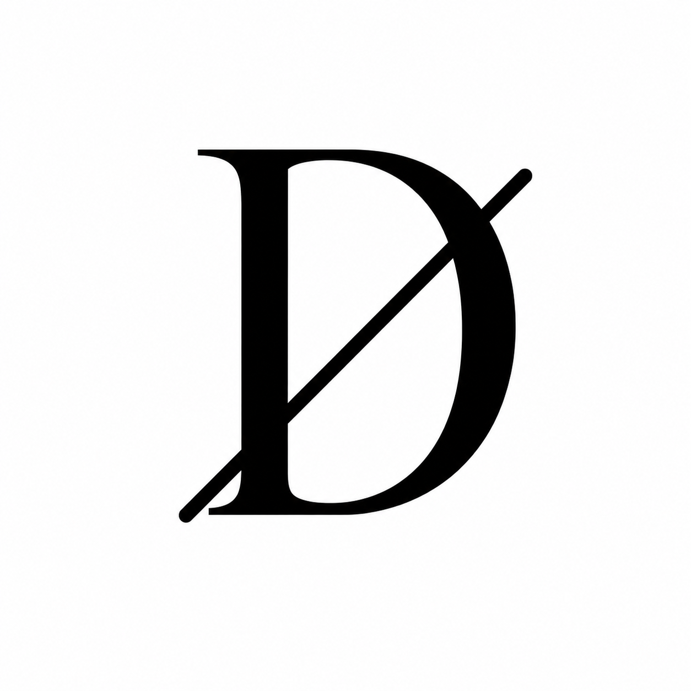
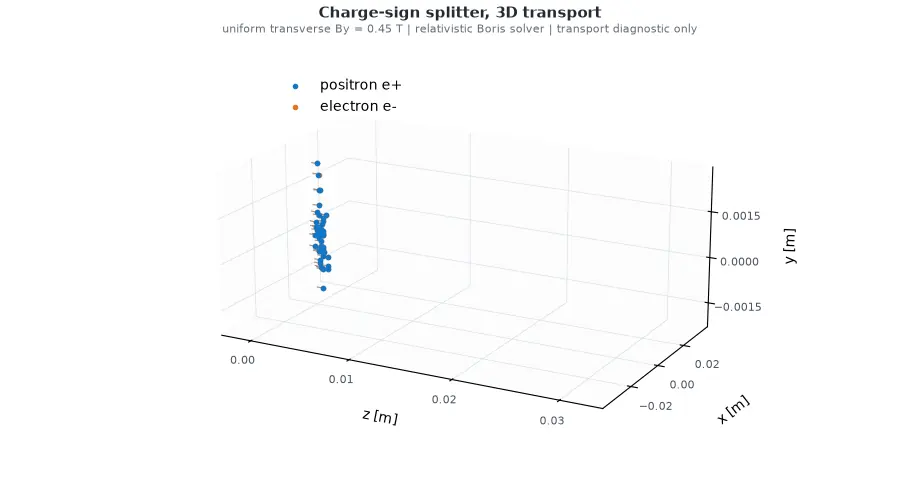
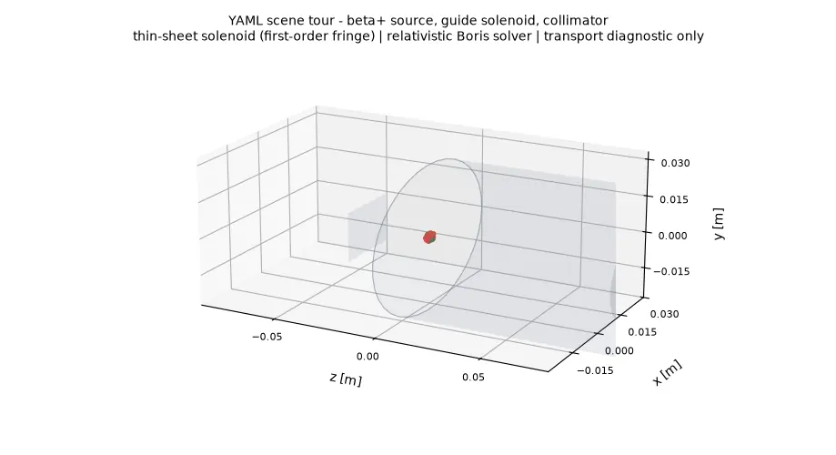
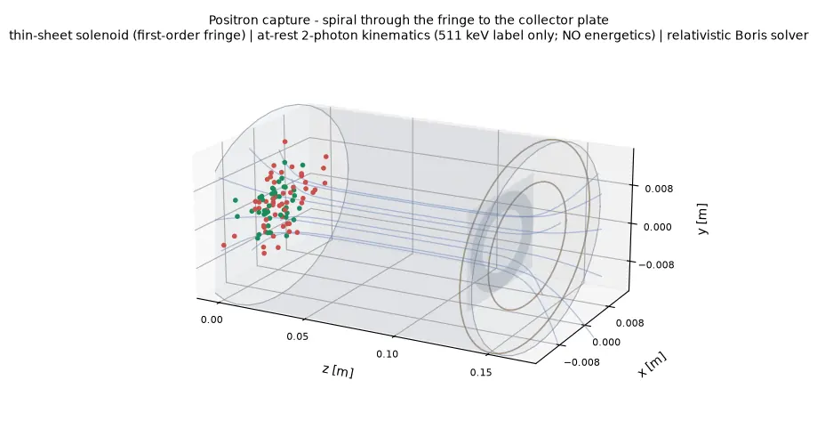
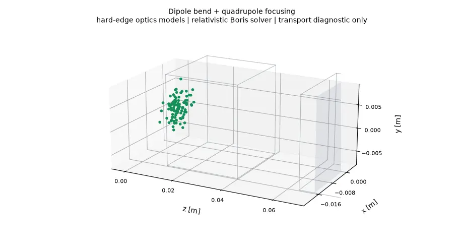
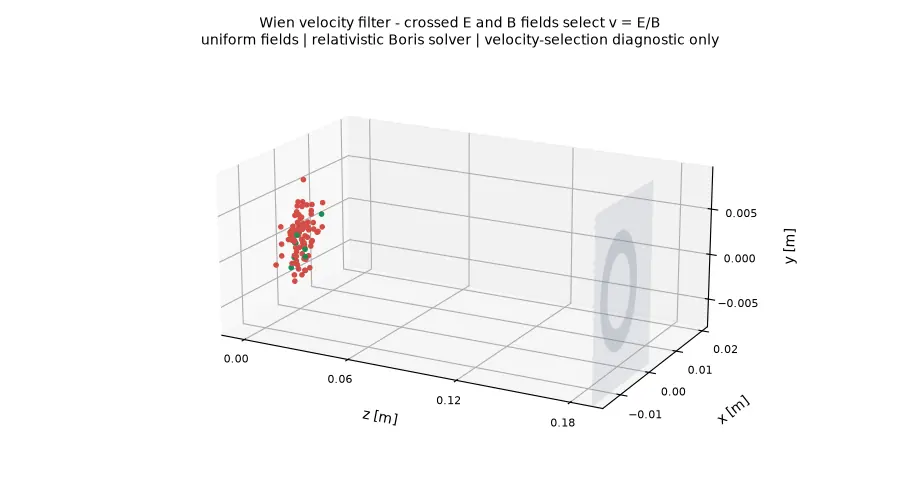
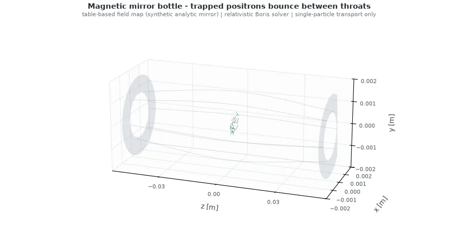
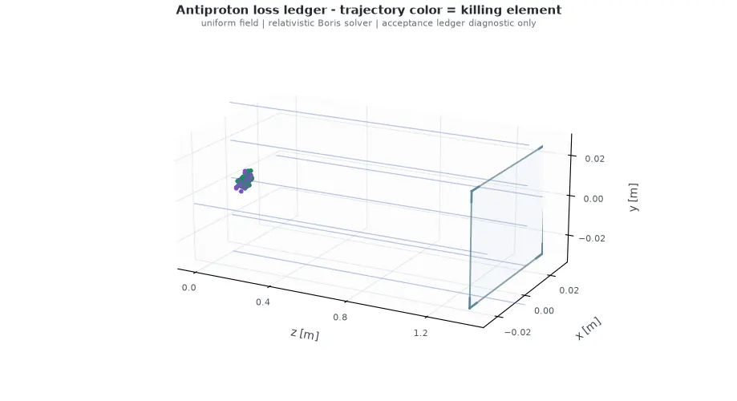
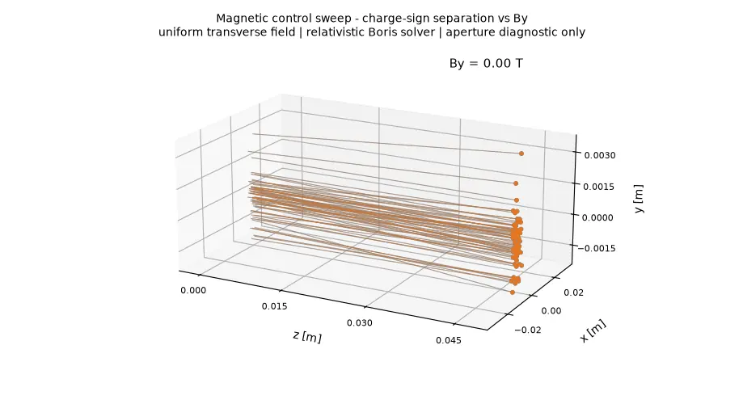

<p align="center">
  
</p>

# Latent Dirac

[](https://github.com/ClawG0d/Latent-Dirac/actions/workflows/ci.yml)
[](pyproject.toml)
[](LICENSE)

Latent Dirac is an open interactive simulation platform for antimatter
factories: declarative scenes of positron and antiproton facilities
(source → transport → capture), batch-parallel simulation and sweeps, and
interactive 3D visualization. The goal is to turn antimatter facility design
iteration from a wall-clock problem into a compute problem.



*Matched positron/electron clouds split by the same transverse field —
rendered, like every animation below, from the recorded trajectories of a
real solver run.*

The platform is built on three pillars:

1. **Platform, not just a tracker** — declarative scene descriptions,
   pluggable solvers, and optional viewers on a shared data model.
2. **Throughput** — batched parameter sweeps designed for a JAX GPU backend
   (n_configs × n_particles in one launch).
3. **Ledger** — loss accounting as a full life-cycle ledger for every
   antiparticle, because antiparticles are extraordinarily expensive.

**Design intent vs current status.** The platform description above is what
Latent Dirac is architected for. The current release is a lightweight
NumPy-based Python core for source-to-acceptance modeling: fast scenario
modeling, parameter sweeps, transport studies, and acceptance accounting,
with placeholder adapters for future calibration against external scientific
tools such as Geant4 and Xsuite. GPU execution and interactive 3D viewers
are roadmap items, not shipped features.
See [docs/roadmap.md](docs/roadmap.md) for the phased plan.

## Fidelity Tiers

Every physics model in Latent Dirac declares one of five fidelity tiers:
**placeholder**, **parameterized**, **surrogate**, **table-based**, or
**externally calibrated**. Performance or physics claims in this repository
must reference reproducible settings, and comparative performance statements
require an open benchmark. Latent Dirac does not try to replace
high-fidelity particle-matter simulation tools; it orchestrates them through
adapters and stays honest about its own approximation level. Every demo
animation below carries its field model and fidelity note in the title.

## Focus

- positron source term models
- antiproton surrogate source term models
- relativistic charged-particle transport in electromagnetic fields
- beamline acceptance
- loss accounting
- accepted-yield diagnostics
- optional visualization backends separated from the physics core

## Current Status

This repository contains the architecture skeleton and minimal working
simulation demos.

Implemented:

- SI-unit constants, unit conversions, and particle species
- `ParticleState` as the universal intermediate state: a pytree-compatible
  dataclass with a per-particle loss ledger (`lost_at_element`)
- parameterized positron pair source model
- simplified beta-plus positron source model
- surrogate antiproton source model
- uniform, solenoid, dipole, quadrupole, and composite field models
- table-based field maps with trilinear interpolation and COMSOL
  regular-grid CSV import
- relativistic Boris transport as a pure-function kernel (dimensionless
  momentum internally, SI at State boundaries)
- aperture and momentum-window acceptance
- staged pipeline loss accounting and the per-particle loss ledger
- accepted-yield and spectrum diagnostics
- declarative YAML/JSON scene schema with drift and monitor elements
  ([docs/scene_schema.md](docs/scene_schema.md))
- scene-driven 3D rendering with per-element fidelity labels (function API)
- optional Matplotlib and Plotly visualization backends
- placeholder adapters for Geant4, Xsuite, and ROOT

Not implemented yet:

- scene CLI and hello-beamline example
- interactive 3D viewer application
- JAX GPU backend and batched sweep API
- CST and SIMION field-map formats
- full electromagnetic or hadronic shower physics
- detailed target engineering
- real facility control systems
- high-yield operational recipes
- material activation or shielding design

## Installation

Create a virtual environment and install the package in editable mode:

```bash
python -m venv .venv
.venv/bin/python -m pip install -e ".[dev]"
```

Install optional visualization dependencies:

```bash
.venv/bin/python -m pip install -e ".[dev,viz]"
```

The simulation core does not import Matplotlib or Plotly. Visualization
packages are only loaded by `latent_dirac.viz` backend methods.

## Demos

Seven 3D demos, each rendered from real simulation output. Most are defined
by a declarative YAML scene under [examples/scenes/](examples/scenes/) —
the scene file *is* the demo. Interactive Plotly versions
(`assets/demos/*_3d.html`) sit next to each scene-driven animation.

```text
source model -> field transport -> beamline acceptance -> loss ledger -> report
```

### Demo 1: A YAML Scene Is the Whole Beamline

One declarative file drives the simulation, the text report, and the 3D
rendering. An isotropic beta-plus source sprays in all directions; the
guide solenoid captures a fraction and the collimator accounts for the rest.

```yaml
schema_version: 1
name: scene-tour
seed: 2026
source:
  type: beta_plus
  label: na22-source
  params: { half_life_s: 8.21e7, beta_plus_branching_ratio: 0.9, initial_activity_bq: 3.7e8,
            endpoint_energy_MeV: 0.546, source_radius_m: 0.001, macro_particles: 96 }
solver: { type: relativistic_boris, dt_s: 4.0e-12, steps: 80 }
elements:
  - { type: solenoid, label: guide-solenoid, b_tesla: 0.5, radius_m: 0.03, length_m: 0.2, center_z_m: 0.1 }
  - { type: drift, label: gap, steps: 20 }
  - { type: aperture, label: collimator, radius_m: 0.012, z_m: 0.1 }
  - { type: monitor, label: end-station }
```



```bash
.venv/bin/python examples/scene_tour_demo.py
```

<details>
<summary>Text report</summary>

```text
Latent Dirac scene report: scene-tour

Stage accounting:
- guide-solenoid: input=3.33e+08, output=3.33e+08, transmission=1, losses=0
- gap: input=3.33e+08, output=3.33e+08, transmission=1, losses=0
- collimator: input=3.33e+08, output=5.20312e+07, transmission=0.156, losses=2.80969e+08
- end-station: input=5.20312e+07, output=5.20312e+07, transmission=1, losses=0

Loss ledger (weighted, by killing element):
- guide-solenoid: 0
- gap: 0
- collimator: 2.80969e+08
- end-station: 0
- surviving: 5.20312e+07

Accepted state:
- weighted count: 5.20312e+07
- mean kinetic energy: 0.244291 MeV

Magnetic field status:
- field model: idealized solenoid (hard-edge)
- B vector [T]: [0, 0, 0.5] inside solenoid envelope
- status: active inside radius 0.03 m and length 0.2 m

Scope note:
- beta-plus transport and acceptance diagnostic only
```

</details>

### Demo 2: Positron Spiral Capture

A parameterized pair source spirals through a hard-edge solenoid; an
aperture and momentum window select the accepted cloud (green) and the
ledger accounts for the rest (red).



```bash
.venv/bin/python examples/positron_capture_demo.py
```

<details>
<summary>Text report</summary>

```text
Latent Dirac scene report: positron-capture

Stage accounting:
- capture-solenoid: input=200, output=200, transmission=1, losses=0
- capture-aperture: input=200, output=87.5, transmission=0.438, losses=112.5
- momentum-cut: input=87.5, output=79.1667, transmission=0.905, losses=8.33333
- end-station: input=79.1667, output=79.1667, transmission=1, losses=0

Loss ledger (weighted, by killing element):
- capture-solenoid: 0
- capture-aperture: 112.5
- momentum-cut: 8.33333
- end-station: 0
- surviving: 79.1667

Accepted state:
- weighted count: 79.1667
- mean kinetic energy: 3.00357 MeV

Magnetic field status:
- field model: idealized solenoid (hard-edge)
- B vector [T]: [0, 0, 0.8] inside solenoid envelope
- status: active inside radius 0.02 m and length 0.15 m

Scope note:
- positron transport and acceptance diagnostic only
```

</details>

### Demo 3: Dipole Bend + Quadrupole Focusing

The field model library at work: a hard-edge dipole bends the positron
beam, then a quadrupole focuses one transverse plane and defocuses the
other — beam optics visible directly in the envelope.



```bash
.venv/bin/python -c "from latent_dirac.scene import load_scene, run_scene; print(run_scene(load_scene('examples/scenes/dipole_quad_line.yaml')).pipeline_result.stage_results)"
```

### Demo 4: Wien Velocity Filter

Crossed uniform E and B fields pass exactly the velocity v = E/B; faster
and slower positrons deflect and are removed by the velocity slit.



```bash
.venv/bin/python examples/wien_filter_demo.py
```

<details>
<summary>Text report (excerpt)</summary>

```text
Wien velocity filter demo

- matched velocity E/B: 2.587e+08 m/s
- accepted fraction: 0.115

Magnetic field status:
- field model: uniform field
- B vector [T]: [0, 0.05, 0]
- E vector [V/m]: [1.2936e+07, 0, 0]
- status: active over all sampled positions
```

</details>

### Demo 5: Magnetic Mirror Bottle

A magnetic-mirror field is sampled onto a regular grid, written as a
COMSOL-style CSV, and loaded back through the real field-map import
pipeline. Trapped positrons (green) bounce between the throats; particles
inside the loss cone (red) escape. The field is synthetic and labeled as
such — a table-based teaser for the Phase 4 trap physics.



```bash
.venv/bin/python examples/magnetic_mirror_demo.py
```

<details>
<summary>Text report</summary>

```text
Magnetic mirror bottle demo

Magnetic field status:
- field model: table-based field map (synthetic analytic mirror)
- on-axis B: 1 T at center, mirror ratio 2
- bottle half-length: 0.05 m

Trapping:
- trapped fraction: 0.750
- max |z| reached: 0.04431 m

Scope note:
- single-particle transport in a static synthetic field map;
  no collisions, no space charge, no trap operations
```

</details>

### Demo 6: The Antiproton Loss Ledger

Every antiparticle's fate is addressable: trajectory color shows which
element killed each antiproton (beam pipe, momentum cut) and green shows
the survivors — the per-particle `lost_at_element` ledger, drawn.



```bash
.venv/bin/python examples/antiproton_ledger_demo.py
```

<details>
<summary>Text report</summary>

```text
Latent Dirac scene report: antiproton-ledger

Stage accounting:
- transport-field: input=1, output=1, transmission=1, losses=0
- beam-pipe: input=1, output=0.989583, transmission=0.99, losses=0.0104167
- momentum-cut: input=0.989583, output=0.447917, transmission=0.453, losses=0.541667
- end-station: input=0.447917, output=0.447917, transmission=1, losses=0

Loss ledger (weighted, by killing element):
- transport-field: 0
- beam-pipe: 0.0104167
- momentum-cut: 0.541667
- end-station: 0
- surviving: 0.447917

Accepted state:
- weighted count: 0.447917
- mean kinetic energy: 2184.17 MeV

Magnetic field status:
- field model: uniform field
- B vector [T]: [0, 0, 1.5]
- status: active over all sampled positions

Scope note:
- antiproton transport and acceptance ledger diagnostic only
```

</details>

### Demo 7: Magnetic Control Sweep

A transverse field ramps from 0 to 0.6 T across the animation: charge-sign
separation grows frame by frame — the shape of the batched parameter
sweeps the JAX backend will run in one launch.



```bash
.venv/bin/python examples/magnetic_control_sweep_demo.py
```

<details>
<summary>Full sweep table</summary>

```text
Magnetic control sweep demo

Shared setup:
- macro-particles per species: 96
- source state: matched positron/electron clouds
- transport model: relativistic Boris solver
- solver step: dt=2e-12 s, steps=80

Magnetic field status:
- field model: uniform transverse field
- B vector [T]: [0, By, 0]
- sweep range: 0 T to 0.6 T

Aperture status:
- transverse x acceptance: abs(x) <= 0.035 m
- accepted and lost fractions are diagnostics for this fixed window

Sweep table:
By [T] | positron mean x [m] | electron mean x [m] | separation [m] | accepted fraction | loss fraction
0.000 | -8.99664e-06 | -8.99664e-06 | 0 | 1.000 | 0.000
0.100 | -0.00846756 | 0.00845077 | 0.0169183 | 1.000 | 0.000
0.200 | -0.0163904 | 0.0163772 | 0.0327676 | 1.000 | 0.000
0.300 | -0.0232884 | 0.0232806 | 0.046569 | 1.000 | 0.000
0.400 | -0.028758 | 0.0287574 | 0.0575155 | 1.000 | 0.000
0.500 | -0.0325148 | 0.0325224 | 0.0650372 | 0.979 | 0.021
0.600 | -0.034414 | 0.0344305 | 0.0688445 | 0.661 | 0.339

Scope note:
- this is a magnetic transport and aperture diagnostic only
```

</details>

Regenerate all animations from source:

```bash
.venv/bin/python tools/generate_hero_3d_webp.py
.venv/bin/python tools/generate_scene_demo_webps.py
```

## Minimal API Sketch

```python
import numpy as np

from latent_dirac.beamline.aperture import Aperture
from latent_dirac.beamline.momentum_window import MomentumWindow
from latent_dirac.core.units import momentum_gev_c_to_si
from latent_dirac.diagnostics.reports import text_report
from latent_dirac.fields.solenoid import SolenoidField
from latent_dirac.pipeline.runner import PipelineRunner
from latent_dirac.pipeline.stage import Stage
from latent_dirac.solvers.relativistic_boris import RelativisticBorisSolver
from latent_dirac.sources.positron_pair import PositronPairSource

source = PositronPairSource(
    primary_count=10_000,
    yield_eplus_per_primary=0.02,
    mean_energy_MeV=3.0,
    energy_spread_MeV=0.4,
    angular_rms_rad=0.03,
    source_sigma_m=1.0e-3,
    bunch_length_s=1.0e-12,
    macro_particles=512,
)

field = SolenoidField(b_tesla=0.8, radius_m=0.05, length_m=0.5)
solver = RelativisticBorisSolver(dt_s=2.0e-12, steps=100)
cloud = source.sample(np.random.default_rng(2026))

result = PipelineRunner(
    stages=[
        Stage("solenoid transport", lambda c: solver.propagate(c, field)),
        Stage("aperture", Aperture(radius_m=0.04, z_m=0.06).apply),
        Stage(
            "momentum window",
            MomentumWindow(momentum_gev_c_to_si(0.001), momentum_gev_c_to_si(0.020)).apply,
        ),
    ]
).run(cloud)

print(text_report(result.stage_results, result.final_cloud, primary_count=10_000))
```

Or drive the same pipeline from a scene file:

```python
from latent_dirac.scene import load_scene, run_scene

result = run_scene(load_scene("examples/scenes/positron_capture.yaml"))
```

## Visualization

Static report figures:

```python
from latent_dirac.viz.matplotlib_backend import MatplotlibBackend

backend = MatplotlibBackend()
fig = backend.plot_energy_spectrum(result.final_cloud)
```

Interactive scene rendering (Plotly):

```python
from latent_dirac.scene import load_scene, run_scene
from latent_dirac.viz.scene_3d import render_scene_3d

scene = load_scene("examples/scenes/positron_capture.yaml")
figure = render_scene_3d(scene, run_scene(scene, record_trajectories=True))
figure.write_html("capture.html")
```

See [docs/rendering.md](docs/rendering.md) for the rendering strategy.

## Tests

```bash
.venv/bin/python -m pytest -q
```

The test suite covers species assumptions, unit conversions, particle-state
handling, the loss ledger, source models, relativistic motion in uniform
fields, Larmor radius validation, field maps, scene validation, pipeline
losses, accepted yield, the documentation honesty discipline, and optional
visualization behavior.

## Documentation

- [Architecture](docs/architecture.md)
- [Scene schema](docs/scene_schema.md)
- [Physics scope](docs/physics_scope.md)
- [Source models](docs/source_models.md)
- [Solver backends](docs/solver_backends.md)
- [Rendering](docs/rendering.md)
- [Validation plan](docs/validation_plan.md)
- [Safety scope](docs/safety_scope.md)
- [License strategy](docs/license_strategy.md)
- [Roadmap](docs/roadmap.md)

## Safety Scope

Latent Dirac is scoped to open simulation architecture and diagnostics for
antimatter facility design studies. The following remain out of scope:

- weaponization scenarios
- energetic-release applications
- real facility control systems
- detailed accelerator target engineering
- high-yield operational recipes
- full shower physics
- annihilation physics
- material activation
- radiation shielding design

The digital-twin direction is limited to offline forward simulation, replay
of measured data, and historical parameter calibration. Latent Dirac provides
no real-time control loops and no interfaces that write back to a facility.

## License

Apache-2.0. See [LICENSE](LICENSE).
