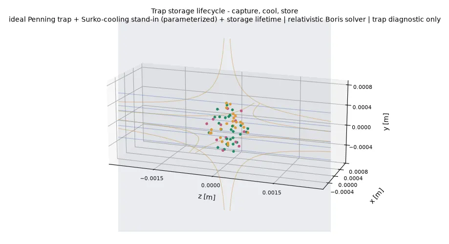
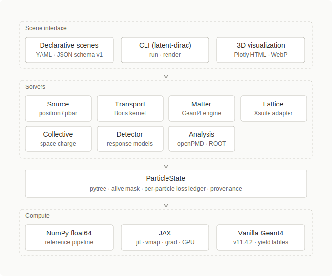
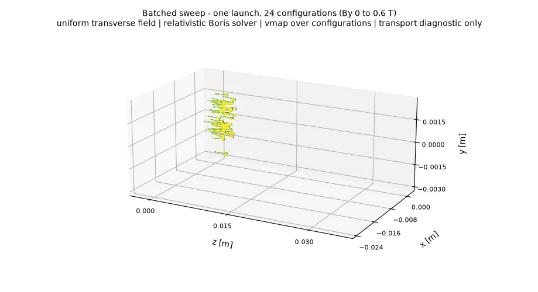
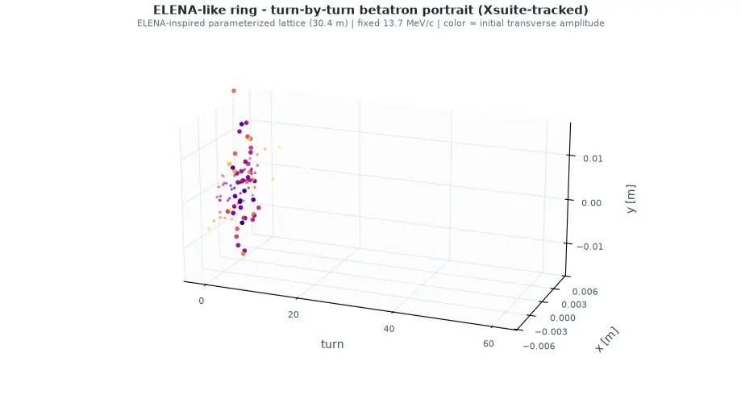
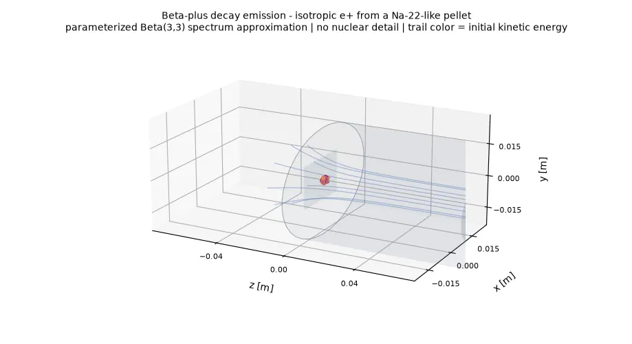
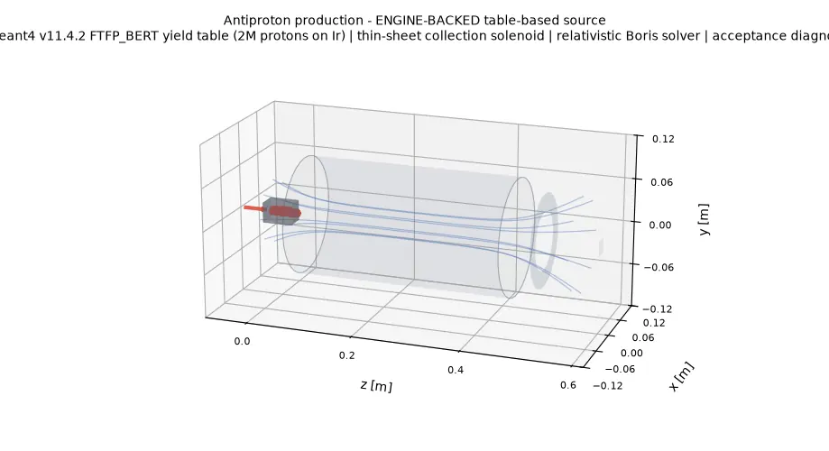
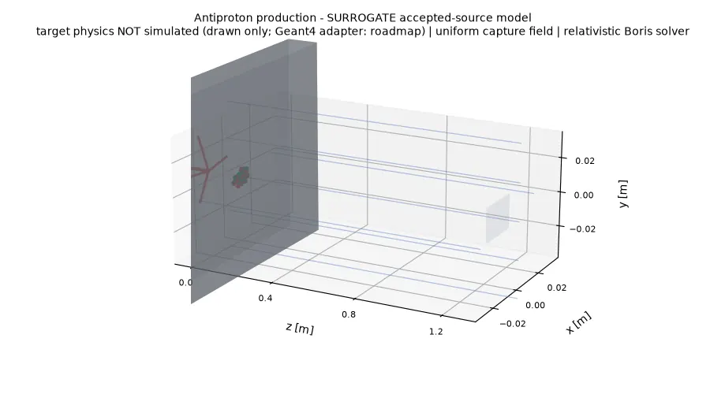
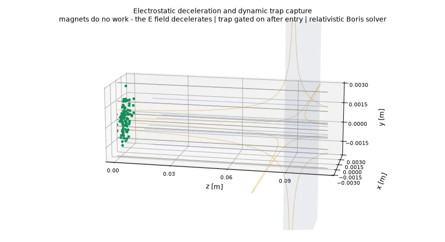
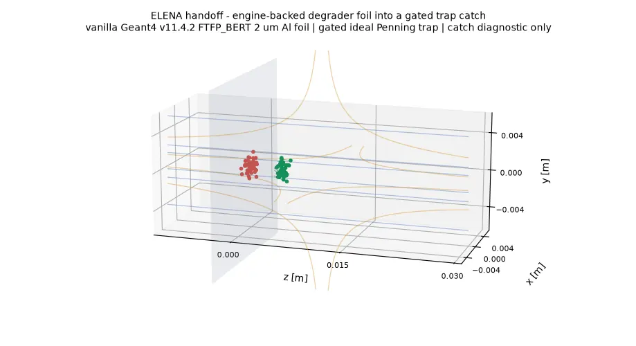
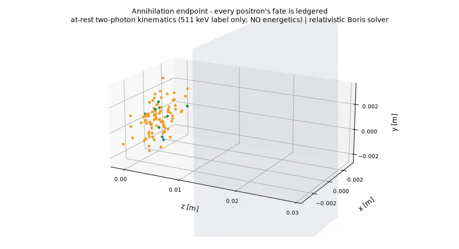

<p align="center">
  
</p>

# Latent Dirac

[](https://github.com/ClawG0d/Latent-Dirac/actions/workflows/ci.yml)
[](pyproject.toml)
[](LICENSE)

**Latent Dirac is an open, interactive simulation platform for antimatter
factories — positron and antiproton facilities from source through
transport to capture — built to turn facility design iteration from a
wall-clock problem into a compute problem.**

Declarative scenes describe the beamline. Batched solvers sweep whole
configuration families in one launch. A per-particle ledger accounts for
every antiparticle, because antiparticles are extraordinarily expensive.



*An eV-scale positron cloud held in an ideal Penning trap — straight
axial B field lines (blue) confine radially, the quadrupole well's
hyperbolic E lines (amber) confine axially. Buffer-gas cooling bursts
visibly shrink the bounce amplitude toward the 300 K floor, while the
per-particle ledger separates positronium-formation losses from
storage losses by color — rendered, like every animation below, from
the recorded trajectories of a real solver run.*

## Table of Contents

1. [What is Latent Dirac?](#what-is-latent-dirac)
2. [Demos](#demos)
3. [The Antimatter Factory Chain](#the-antimatter-factory-chain)
4. [Quick Installation](#quick-installation)
5. [Using the API](#using-the-api)
6. [Current Status](#current-status)
7. [Documentation](#documentation)
8. [Contributing](#contributing)
9. [License and Acknowledgments](#license-and-acknowledgments)

## What is Latent Dirac?



Latent Dirac is organized as four layers. A declarative **scene
interface** (YAML/JSON schema, CLI, 3D rendering) drives a set of
**solvers** — one authoritative component per physics domain — that all
exchange the same **`ParticleState`**: a pytree-compatible state
carrying an alive mask, a per-particle loss ledger, and result
provenance. The **compute** layer underneath pairs a NumPy float64
reference pipeline with a JAX backend (jit, vmap, autodiff) and the
vendored vanilla Geant4 engine for particle-matter physics.


### Solvers

Each solver component is authoritative over one physics domain, behind
one scene schema, one state container (`ParticleState`), and one
per-particle loss ledger that spans component boundaries. First-party
solvers live on the NumPy/JAX substrate and are batchable and
differentiable; engine-backed solvers enter behind adapters and anchor
fidelity. Every physics model declares one of five fidelity tiers:
placeholder, parameterized, surrogate, table-based, or
externally calibrated — and every demo title carries its field model
and fidelity note. Design record:
[the solver composition spec](docs/superpowers/specs/2026-07-05-solver-zoo-composition-design.md).

| Component  | Authority domain                      | Form        | Backing                                     | Status |
| ---------- | ------------------------------------- | ----------- | ------------------------------------------- | ------ |
| Source     | positron / antiproton source terms    | sampler     | first-party (pair, beta-plus, surrogate) + engine yield-table replay | shipped (first engine table committed); more tables per M3 |
| Transport  | vacuum EM transport                   | stepper     | first-party Boris kernel (NumPy + JAX)      | shipped |
| Lattice    | decelerator rings, transfer lines     | stepper     | Xsuite adapter                              | shipped (adapter + `xsuite_lattice` scene element) |
| Matter     | targets, degraders, annihilation      | transformer | vendored vanilla Geant4 v11.4.2             | shipped (adapter + `matter_slab` scene element; subprocess + files; yield tables for sources) |
| Collective | in-trap space charge                  | stepper     | first-party mean-field v1, later WarpX      | mean-field v1 shipped (parameterized, beta<<1) |
| Detector   | detector response                     | transformer | parameterized model first, Garfield++ later | planned |
| Analysis   | persistent output, ecosystem exchange | sink        | openPMD + ROOT via uproot                   | shipped (openPMD write; ROOT round-trip) |

Forms: a *sampler* produces the initial particle cloud; a *stepper*
advances `ParticleState` and can be batched and differentiated on the
JAX substrate; a *transformer* is an engine boundary (cloud in, cloud
plus events out — gradients stop here and re-enter via distilled yield
tables and surrogates); a *sink* writes outputs. Engine-backed results
always carry their provenance (engine version, physics list, dataset
versions, patch list): the engine is invisible in the API, never in the
report.

## Demos

Sixteen 3D demos, each rendered from real simulation output. Most are defined
by a declarative YAML scene under [examples/scenes/](examples/scenes/) —
the scene file *is* the demo. Interactive Plotly versions
(`assets/demos/*_3d.html`) sit next to each scene-driven animation.
Every scene demo also draws the field lines of its model fields
(B steel blue, E amber) — streamlines integrated from the exact field
being simulated, so each idealization renders as-is: thin-sheet fringes
funnel, hard edges cut off abruptly, the ideal trap's well reaches the
frame edge.

```text
source model -> field transport -> beamline acceptance -> loss ledger -> report
```


*The opening act: matched positron/electron clouds split by the same
transverse field — equal mass, opposite charge, one Lorentz force.*

### Demo 1: A YAML Scene Is the Whole Beamline

One declarative file drives the simulation, the text report, and the 3D
rendering. An isotropic beta-plus source sprays in all directions; the
guide solenoid captures a fraction and the collimator accounts for the rest.

```yaml
schema_version: 1
name: scene-tour
seed: 2026
source:
  type: beta_plus
  label: na22-source
  params: { half_life_s: 8.21e7, beta_plus_branching_ratio: 0.9, initial_activity_bq: 3.7e8,
            endpoint_energy_MeV: 0.546, source_radius_m: 0.001, macro_particles: 96 }
solver: { type: relativistic_boris, dt_s: 4.0e-12, steps: 80 }
elements:
  - { type: solenoid, label: guide-solenoid, b_tesla: 0.5, radius_m: 0.03, length_m: 0.2, center_z_m: 0.1,
      profile: thin_sheet }
  - { type: drift, label: gap, steps: 20 }
  - { type: aperture, label: collimator, radius_m: 0.012, z_m: 0.1 }
  - { type: monitor, label: end-station }
```


```bash
.venv/bin/python examples/scene_tour_demo.py
```

<details>
<summary>Text report</summary>

```text
Latent Dirac scene report: scene-tour

Stage accounting:
- guide-solenoid: input=3.33e+08, output=3.33e+08, transmission=1, losses=0
- gap: input=3.33e+08, output=3.33e+08, transmission=1, losses=0
- collimator: input=3.33e+08, output=1.00594e+08, transmission=0.302, losses=2.32406e+08
- end-station: input=1.00594e+08, output=1.00594e+08, transmission=1, losses=0

Loss ledger (weighted, by killing element):
- guide-solenoid: 0
- gap: 0
- collimator: 2.32406e+08
- end-station: 0
- surviving: 1.00594e+08

Accepted state:
- weighted count: 1.00594e+08
- mean kinetic energy: 0.234927 MeV

Magnetic field status:
- field model: thin-sheet solenoid (smooth finite-length profile, first-order fringe)
- sheet strength B0 [T]: 0.5 (center Bz below B0 for short coils)
- status: sheet radius 0.03 m, length 0.2 m, smooth fringe outside

Scope note:
- beta-plus transport and acceptance diagnostic only
```

</details>

### Demo 2: Positron Spiral Capture

A parameterized pair source spirals through the smooth fringe of a
thin-sheet solenoid — watch the spirals tighten as the field funnels
them in; an aperture and momentum window select the accepted cloud
(green), the ledger accounts for the rest (red), and the collector
plate ends every accepted positron in a back-to-back photon pair
(at-rest two-photon kinematics; 511 keV as a label only, no
energetics).


```bash
.venv/bin/python examples/positron_capture_demo.py
```

<details>
<summary>Text report</summary>

```text
Latent Dirac scene report: positron-capture

Stage accounting:
- capture-solenoid: input=200, output=200, transmission=1, losses=0
- capture-aperture: input=200, output=97.9167, transmission=0.49, losses=102.083
- momentum-cut: input=97.9167, output=89.5833, transmission=0.915, losses=8.33333
- end-station: input=89.5833, output=89.5833, transmission=1, losses=0
- collector-drift: input=89.5833, output=89.5833, transmission=1, losses=0
- collector-plate: input=89.5833, output=0, transmission=0, losses=89.5833

Loss ledger (weighted, by killing element):
- capture-solenoid: 0
- capture-aperture: 102.083
- momentum-cut: 8.33333
- end-station: 0
- collector-drift: 0
- collector-plate: 89.5833
- surviving: 0

Accepted state:
- weighted count: 0
- mean kinetic energy: 0 MeV

Annihilation endpoint 'collector-plate':
- events: 43
- at-rest two-photon kinematics (511 keV label only; no energetics)

Magnetic field status:
- field model: thin-sheet solenoid (smooth finite-length profile, first-order fringe)
- sheet strength B0 [T]: 0.8 (center Bz below B0 for short coils)
- status: sheet radius 0.02 m, length 0.15 m, smooth fringe outside

Scope note:
- positron transport and acceptance diagnostic only
```

</details>

### Demo 3: Dipole Bend + Quadrupole Focusing

The field model library at work: a hard-edge dipole bends the positron
beam, then a quadrupole focuses one transverse plane and defocuses the
other — beam optics visible directly in the envelope.


```bash
.venv/bin/python -c "from latent_dirac.scene import load_scene, run_scene; print(run_scene(load_scene('examples/scenes/dipole_quad_line.yaml')).pipeline_result.stage_results)"
```

### Demo 4: Wien Velocity Filter

Crossed uniform E and B fields pass exactly the velocity v = E/B; faster
and slower positrons deflect and are removed by the velocity slit.


```bash
.venv/bin/python examples/wien_filter_demo.py
```

<details>
<summary>Text report (excerpt)</summary>

```text
Wien velocity filter demo

- matched velocity E/B: 2.587e+08 m/s
- accepted fraction: 0.115

Magnetic field status:
- field model: uniform field
- B vector [T]: [0, 0.05, 0]
- E vector [V/m]: [1.2936e+07, 0, 0]
- status: active over all sampled positions
```

</details>

### Demo 5: Magnetic Mirror Bottle

A magnetic-mirror field is sampled onto a regular grid, written as a
COMSOL-style CSV, and loaded back through the real field-map import
pipeline. Trapped positrons (green) bounce between the throats; particles
inside the loss cone (red) escape. The field is synthetic and labeled as
such — a table-based teaser for the Phase 4 trap physics.


```bash
.venv/bin/python examples/magnetic_mirror_demo.py
```

<details>
<summary>Text report</summary>

```text
Magnetic mirror bottle demo

Magnetic field status:
- field model: table-based field map (synthetic analytic mirror)
- on-axis B: 1 T at center, mirror ratio 2
- bottle half-length: 0.05 m

Trapping:
- trapped fraction: 0.750
- max |z| reached: 0.04431 m

Scope note:
- single-particle transport in a static synthetic field map;
  no collisions, no space charge, no trap operations
```

</details>

### Demo 6: The Antiproton Loss Ledger

Every antiparticle's fate is addressable: trajectory color shows which
element killed each antiproton (beam pipe, momentum cut) and green shows
the survivors — the per-particle `lost_at_element` ledger, drawn.


```bash
.venv/bin/python examples/antiproton_ledger_demo.py
```

<details>
<summary>Text report</summary>

```text
Latent Dirac scene report: antiproton-ledger

Stage accounting:
- transport-field: input=1, output=1, transmission=1, losses=0
- beam-pipe: input=1, output=0.989583, transmission=0.99, losses=0.0104167
- momentum-cut: input=0.989583, output=0.447917, transmission=0.453, losses=0.541667
- end-station: input=0.447917, output=0.447917, transmission=1, losses=0

Loss ledger (weighted, by killing element):
- transport-field: 0
- beam-pipe: 0.0104167
- momentum-cut: 0.541667
- end-station: 0
- surviving: 0.447917

Accepted state:
- weighted count: 0.447917
- mean kinetic energy: 2184.17 MeV

Magnetic field status:
- field model: uniform field
- B vector [T]: [0, 0, 1.5]
- status: active over all sampled positions

Scope note:
- antiproton transport and acceptance ledger diagnostic only
```

</details>

### Demo 7: Magnetic Control Sweep

A transverse field ramps from 0 to 0.6 T across the animation: charge-sign
separation grows frame by frame — the shape of the batched parameter
sweeps the JAX backend will run in one launch.


```bash
.venv/bin/python examples/magnetic_control_sweep_demo.py
```

<details>
<summary>Full sweep table</summary>

```text
Magnetic control sweep demo

Shared setup:
- macro-particles per species: 96
- source state: matched positron/electron clouds
- transport model: relativistic Boris solver
- solver step: dt=2e-12 s, steps=80

Magnetic field status:
- field model: uniform transverse field
- B vector [T]: [0, By, 0]
- sweep range: 0 T to 0.6 T

Aperture status:
- transverse x acceptance: abs(x) <= 0.035 m
- accepted and lost fractions are diagnostics for this fixed window

Sweep table:
By [T] | positron mean x [m] | electron mean x [m] | separation [m] | accepted fraction | loss fraction
0.000 | -8.99664e-06 | -8.99664e-06 | 0 | 1.000 | 0.000
0.100 | -0.00846756 | 0.00845077 | 0.0169183 | 1.000 | 0.000
0.200 | -0.0163904 | 0.0163772 | 0.0327676 | 1.000 | 0.000
0.300 | -0.0232884 | 0.0232806 | 0.046569 | 1.000 | 0.000
0.400 | -0.028758 | 0.0287574 | 0.0575155 | 1.000 | 0.000
0.500 | -0.0325148 | 0.0325224 | 0.0650372 | 0.979 | 0.021
0.600 | -0.034414 | 0.0344305 | 0.0688445 | 0.661 | 0.339

Scope note:
- this is a magnetic transport and aperture diagnostic only
```

</details>

### Demo 8: One Launch, 24 Beamlines

The batched JAX backend runs a whole configuration family as a single
jit-compiled vmap program: 24 values of the transverse field, one launch,
trails colored by configuration. This is the shape of the parameter scans
and optimizer generations the backend exists for (CPU-validated; GPU
throughput is not yet measured).



```python
from latent_dirac.backends.jax_scene import BatchedSceneProgram
from latent_dirac.scene import load_scene

program = BatchedSceneProgram(
    load_scene("examples/scenes/batched_sweep.yaml"),
    override_keys=("sweep-field.B_vector_t",),
    record_stride=4,
)
result = program.run({"sweep-field.B_vector_t": b_vectors})  # (24, 3)
result.accepted_fraction  # (24,)
result.trajectories       # (24, S, N, 3)
```

### Demo 9: Trap Storage Lifecycle — Capture, Cool, Store

The trap-physics elements working together: an isotropic eV-scale
positron bunch (a parameterized prepared cloud) oscillates in an ideal
Penning trap while transport windows alternate with buffer-gas cooling
bursts — the mean axial bounce amplitude collapses from 1.6 mm to
0.23 mm (~7x) as the cloud cools from 10.3 eV to a 0.06 eV mean,
approaching the 300 K floor (38.8 meV). The ledger separates two loss
channels by color: positronium formation during the cooling stages and
annihilation on residual gas during a 60 s storage hold. Trap
eigenfrequencies are the validated analytic ones; cooling is the
constant-rate Surko stand-in (parameterized tier); and the µs-scale
cooling holds freeze positions while only the ns-scale transport
windows are animated — an idealization of this rendering, stated here.


```bash
.venv/bin/latent-dirac run examples/scenes/trap_storage_lifecycle.yaml
```

<details>
<summary>Text report (excerpt)</summary>

```text
Latent Dirac scene report: trap-storage-lifecycle

Loss ledger (weighted, by killing element):
- cool-1: 2.08125e+07
- cool-2: 4.1625e+07
- cool-3: 4.68281e+07
- cool-4: 2.60156e+07
- storage-hold: 5.20312e+07
- surviving: 1.45688e+08

Accepted state:
- weighted count: 1.45688e+08
- mean kinetic energy: 6.00078e-08 MeV

Magnetic field status:
- field model: ideal Penning trap (quadrupole well + axial B)
- well parameter V0: 50 V, d: 0.005 m, axial B: 0.05 T
- status: ideal global field (no hard edge)
```

</details>

### Demo 10: ELENA-like Ring — Turn-by-Turn Betatron Portrait

The `xsuite_lattice` element tracking a full ring: an ELENA-inspired
parameterized lattice (30.4 m circumference, six rectangular-edge
bends, antiproton reference at 13.7 MeV/c — built programmatically by
[tools/make_elena_like_line.py](tools/make_elena_like_line.py), which
is the committed lattice's full provenance; NOT the real ELENA optics).
Sixty turns of xtrack tracking render as a stroboscopic Poincaré-style
portrait — once-per-turn samples along a turn axis, color mapping the
initial transverse amplitude; the bunch column stays confined because
the working point is stable (tunes qx = 2.68, qy = 1.24). The in-ring
deceleration — RF ramp, electron cooling — is not modeled and stays on
the not-implemented list. Regenerating needs the `[xsuite]` extra; the
generator skips this demo without it.



```bash
.venv/bin/latent-dirac run examples/scenes/elena_ring.yaml
```

<details>
<summary>Text report</summary>

```text
Latent Dirac scene report: elena-ring

Stage accounting:
- ring: input=1e+07, output=1e+07, transmission=1, losses=0
- end-station: input=1e+07, output=1e+07, transmission=1, losses=0

Loss ledger (weighted, by killing element):
- ring: 0
- end-station: 0
- surviving: 1e+07

Accepted state:
- weighted count: 1e+07
- mean kinetic energy: 0.100014 MeV

Scope note:
- transport and acceptance diagnostic only
```

</details>

## The Antimatter Factory Chain

Four demos telling the company narrative end to end — source, production,
deceleration and capture, and the ledgered endpoint. Each stage is a
declarative scene; the ledger accounts for every antiparticle across the
chain.

### Chain 1: Beta-Plus Decay Emission

Positrons are born in radioactive decay: an isotropic burst from a
Na-22-like pellet, trail color mapping the continuous beta spectrum
(parameterized Beta(3,3) approximation — no nuclear detail). The guide
solenoid captures a fraction; the collimator accounts for the rest.



```bash
.venv/bin/latent-dirac run examples/scenes/decay_emission.yaml
```

### Chain 2: Antiproton Production at a Target (Engine-Backed)

High-energy protons striking a target produce antiprotons — hadronic
shower physics that the Python core deliberately does not implement.
Here it is delegated to the vendored engine: `engine/yieldgen`
(vanilla Geant4 v11.4.2, FTFP_BERT) fires 2,000,000 protons at 26 GeV/c
into an iridium stand-in target offline and records every antiproton
exiting the target surface — 2,547 of them, a yield of 1.3e-3 per
proton, forward-peaked with a median momentum of 3.2 GeV/c (inside the
AD-like collection band used below). The committed table
([examples/data/pbar_yield_ftfp_bert_26gevc_ir.csv](examples/data/pbar_yield_ftfp_bert_26gevc_ir.csv),
provenance four-tuple in its header) is replayed by the `table_based`
`antiproton_yield_table` source through a collection solenoid, aperture,
and an AD-like 3.0–4.2 GeV/c momentum window; the scene report prints
the engine four-tuple. The interactive rendering lives at
`assets/demos/target_production_engine_3d.html`.



```bash
.venv/bin/latent-dirac run examples/scenes/target_production_engine.yaml
```

<details>
<summary>Text report</summary>

```text
Latent Dirac scene report: target-production-engine

Stage accounting:
- collection-solenoid: input=1.91025e+10, output=1.91025e+10, transmission=1, losses=0
- collection-aperture: input=1.91025e+10, output=4.1625e+09, transmission=0.218, losses=1.494e+10
- ad-momentum-cut: input=4.1625e+09, output=7.95e+08, transmission=0.191, losses=3.3675e+09
- end-station: input=7.95e+08, output=7.95e+08, transmission=1, losses=0

Loss ledger (weighted, by killing element):
- collection-solenoid: 0
- collection-aperture: 1.494e+10
- ad-momentum-cut: 3.3675e+09
- end-station: 0
- surviving: 7.95e+08

Accepted state:
- weighted count: 7.95e+08
- mean kinetic energy: 2829.73 MeV

Source provenance (engine four-tuple):
- model type: table_based
- geant4 version: $Name: geant4-11-04-patch-02 [MT]$
- physics list: FTFP_BERT
- datasets: G4NDL4.7.1,G4EMLOW8.8,PhotonEvaporation6.1.2,RadioactiveDecay6.1.2,G4PARTICLEXS4.2,G4PII1.3,RealSurface2.2,G4SAIDDATA2.0,G4ABLA3.3,G4INCL1.3,G4ENSDFSTATE3.0,G4CHANNELING2.0
- patches: none
- table primaries: 2000000

Magnetic field status:
- field model: thin-sheet solenoid (smooth finite-length profile, first-order fringe)
- sheet strength B0 [T]: 2 (center Bz below B0 for short coils)
- status: sheet radius 0.08 m, length 0.4 m, smooth fringe outside

Scope note:
- transport and acceptance diagnostic only
```

</details>

<details>
<summary>Surrogate variant (pre-engine)</summary>

The original stage kept the target as **drawn annotations only** and
sampled the antiproton cloud from the surrogate accepted-source model —
the honest placeholder this engine-backed version replaces. (Both the
Matter adapter and the `matter_slab` scene element have since shipped.)



```bash
.venv/bin/latent-dirac run examples/scenes/target_production.yaml
```

</details>

### Chain 3: Electrostatic Deceleration and Dynamic Capture

Magnetic fields do no work — they bend and confine, but the deceleration
is done by the electric field. A keV positron bunch climbs a retarding E
field (watch the helix pitch shrink), coasts field-free into the trap
region, and then the **entire trap field (well and axial B) switches on
around the bunch** — an idealized time-gated capture in the spirit of the
real accumulator sequence — leaving the positrons bouncing in the well.



```bash
.venv/bin/latent-dirac run examples/scenes/decel_capture.yaml
```

### Chain 3b: The ELENA Handoff (Engine-Backed Degrader Catch)

The downstream half of the AD/ELENA story, engine-anchored: a
parameterized ELENA-extraction bunch (100 keV antiprotons, 13.7 MeV/c)
hits a 2 µm aluminium degrader foil — energy loss, scattering, and
in-foil annihilation computed by the vendored vanilla Geant4 engine via
the `matter_slab` element — and the keV survivors drift into an ideal
Penning trap whose whole field (well and axial B) switches on around
the bunch, the same idealized instantaneous catch the deceleration demo
established. Of 96 macro-antiprotons, 53 annihilate in the foil
(ledgered by the engine stage), 28 are caught cold (0.1–2.8 keV) inside
the −10 kV well, and the rest arrive too fast and oscillate at large
amplitude in the ideal global well (finite electrodes are field-map
territory). The in-ring deceleration itself — RF ramp, electron
cooling — is not modeled and stays on the not-implemented list.
Regenerating this demo needs the engine transformer
(`LATENT_DIRAC_G4_TRANSFORMER`); without it the generator skips it and
the committed asset stays.



```bash
.venv/bin/latent-dirac run examples/scenes/elena_handoff.yaml
```

<details>
<summary>Text report (excerpt)</summary>

```text
Latent Dirac scene report: elena-handoff

Stage accounting:
- degrader-foil: input=3e+07, output=1.34375e+07, transmission=0.448, losses=1.65625e+07
- catch-trap: input=1.34375e+07, output=1.34375e+07, transmission=1, losses=0
- end-station: input=1.34375e+07, output=1.34375e+07, transmission=1, losses=0

Accepted state:
- weighted count: 1.34375e+07
- mean kinetic energy: 0.00228277 MeV

Matter engine provenance (four-tuple):
- material: G4_Al, thickness: 0.002 mm
- geant4 version: $Name: geant4-11-04-patch-02 [MT]$
- physics list: FTFP_BERT
- datasets: G4NDL4.7.1,G4EMLOW8.8,PhotonEvaporation6.1.2,RadioactiveDecay6.1.2,G4PARTICLEXS4.2,G4PII1.3,RealSurface2.2,G4SAIDDATA2.0,G4ABLA3.3,G4INCL1.3,G4ENSDFSTATE3.0,G4CHANNELING2.0
- patches: none

Magnetic field status:
- field model: ideal Penning trap (quadrupole well + axial B)
- well parameter V0: -10000 V, d: 0.012 m, axial B: 3 T
- status: ideal global field (no hard edge)
- gate: active for t in [6e-09 s, 1 s) (ideal instantaneous switching)
```

</details>

### Chain 4: The Annihilation Endpoint

Every antiparticle's story ends somewhere, and the ledger records it.
Positrons reaching the plate are stamped in `lost_at_element` and each
event emits a back-to-back photon pair (at-rest two-photon kinematics;
511 keV appears as a label only — energy release and deposition stay
outside the project scope).



```bash
.venv/bin/latent-dirac run examples/scenes/annihilation_endpoint.yaml
```

Regenerate all animations from source:

```bash
.venv/bin/python tools/generate_hero_3d_webp.py
.venv/bin/python tools/generate_scene_demo_webps.py
```

## Quick Installation

Create a virtual environment and install the package in editable mode:

```bash
python -m venv .venv
.venv/bin/python -m pip install -e ".[dev]"
```

Optional extras:

| Extra | Provides |
| ----- | -------- |
| `viz` | Matplotlib, Pillow, and Plotly visualization backends |
| `jax` | the batched JAX backend |

Install everything with `pip install -e ".[dev,viz,jax]"`. The simulation
core imports none of these; visualization packages load only inside
`latent_dirac.viz` backend methods. Building the vendored Geant4 engine
is a separate, optional step — see [engine/README.md](engine/README.md).

### Hello Beamline (60 seconds)

One YAML scene, one report, one interactive 3D rendering:

```bash
.venv/bin/latent-dirac run examples/scenes/hello_beamline.yaml
.venv/bin/latent-dirac render examples/scenes/hello_beamline.yaml -o hello.html
```

Open `hello.html` in a browser to orbit the beamline: solenoid, aperture,
trajectories, accepted/lost split, and per-element fidelity labels in the
hover text.

## Using the API

The scene layer is a thin veneer over plain Python objects — the same
pipeline can be built by hand:

```python
import numpy as np

from latent_dirac.beamline.aperture import Aperture
from latent_dirac.beamline.momentum_window import MomentumWindow
from latent_dirac.core.units import momentum_gev_c_to_si
from latent_dirac.diagnostics.reports import text_report
from latent_dirac.fields.solenoid import SolenoidField
from latent_dirac.pipeline.runner import PipelineRunner
from latent_dirac.pipeline.stage import Stage
from latent_dirac.solvers.relativistic_boris import RelativisticBorisSolver
from latent_dirac.sources.positron_pair import PositronPairSource

source = PositronPairSource(
    primary_count=10_000,
    yield_eplus_per_primary=0.02,
    mean_energy_MeV=3.0,
    energy_spread_MeV=0.4,
    angular_rms_rad=0.03,
    source_sigma_m=1.0e-3,
    bunch_length_s=1.0e-12,
    macro_particles=512,
)

field = SolenoidField(b_tesla=0.8, radius_m=0.05, length_m=0.5)
solver = RelativisticBorisSolver(dt_s=2.0e-12, steps=100)
cloud = source.sample(np.random.default_rng(2026))

result = PipelineRunner(
    stages=[
        Stage("solenoid transport", lambda c: solver.propagate(c, field)),
        Stage("aperture", Aperture(radius_m=0.04, z_m=0.06).apply),
        Stage(
            "momentum window",
            MomentumWindow(momentum_gev_c_to_si(0.001), momentum_gev_c_to_si(0.020)).apply,
        ),
    ]
).run(cloud)

print(text_report(result.stage_results, result.final_cloud, primary_count=10_000))
```

Or drive the same pipeline from a scene file:

```python
from latent_dirac.scene import load_scene, run_scene

result = run_scene(load_scene("examples/scenes/positron_capture.yaml"))
```

### Visualization

Static report figures:

```python
from latent_dirac.viz.matplotlib_backend import MatplotlibBackend

backend = MatplotlibBackend()
fig = backend.plot_energy_spectrum(result.final_cloud)
```

Interactive scene rendering (Plotly):

```python
from latent_dirac.scene import load_scene, run_scene
from latent_dirac.viz.scene_3d import render_scene_3d

scene = load_scene("examples/scenes/positron_capture.yaml")
figure = render_scene_3d(scene, run_scene(scene, record_trajectories=True))
figure.write_html("capture.html")
```

See [docs/rendering.md](docs/rendering.md) for the rendering strategy.

### Tests

```bash
.venv/bin/python -m pytest -q
```

The test suite covers species assumptions, unit conversions, particle-state
handling, the loss ledger, source models, relativistic motion in uniform
fields, Larmor radius validation, field maps, scene validation, pipeline
losses, accepted yield, the documentation honesty discipline, and optional
visualization behavior.

## Current Status

This repository contains the architecture skeleton and minimal working
simulation demos.

Implemented:

- SI-unit constants, unit conversions, and particle species
- `ParticleState` as the universal intermediate state: a pytree-compatible
  dataclass with a per-particle loss ledger (`lost_at_element`)
- parameterized positron pair source model
- simplified beta-plus positron source model
- surrogate antiproton source model
- uniform, solenoid, dipole, quadrupole, composite, and ideal Penning
  trap field models (analytic eigenfrequencies exposed and validated)
- the `thin_sheet` solenoid profile: a smooth finite-length
  thin-current-sheet field with a first-order radial fringe (exactly
  divergence-free; Busch rotation validated via canonical angular
  momentum), selectable per element and available on both backends
- table-based field maps with trilinear interpolation and COMSOL
  regular-grid CSV import
- relativistic Boris transport as a pure-function kernel (dimensionless
  momentum internally, SI at State boundaries)
- aperture and momentum-window acceptance
- staged pipeline loss accounting and the per-particle loss ledger
- accepted-yield and spectrum diagnostics
- declarative YAML/JSON scene schema with drift and monitor elements
  ([docs/scene_schema.md](docs/scene_schema.md))
- scene-driven 3D rendering with per-element fidelity labels (function API)
- JAX batched scene execution (`run_scene_batched` and the reusable
  `BatchedSceneProgram`: vmap over configurations, optional `[jax]` extra;
  validated element-wise against the NumPy float64 pipeline on CPU — GPU
  throughput is not yet measured)
- Xopt-compatible scene evaluator (`make_scene_evaluator`: plain-callable
  convention, `evaluate.batch` runs a candidate generation in one launch;
  xopt itself is not a dependency)
- the `latent-dirac` CLI: `run` prints the scene report, `render` writes
  the interactive 3D HTML (`--animate` for the play/scrub animation)
- the animated interactive 3D viewer
  (`latent_dirac.viz.scene_3d.render_scene_animation`): play/pause +
  scrub of the recorded cloud traversing the scene, lost particles
  freezing at their loss point, colorable by fate / ledger / energy;
  self-contained HTML, no server
- time-gated fields (`TimeGatedField`; `t_on_s`/`t_off_s` on
  `uniform_field` and `penning_trap` scene elements, both backends)
- the `annihilation_plate` element: a ledgered loss endpoint recording
  at-rest two-photon kinematics (no energetics; NumPy pipeline only)
- the `residual_gas_loss` element: storage lifetime as stochastic
  annihilation on residual gas over a hold time (exponential survival at
  a directly-supplied `mean_lifetime_s`, parameterized tier; ledgered
  per particle, NumPy pipeline only)
- the `buffer_gas_cooling` element: Surko-type cooling in two modes — a
  constant-rate parameterized stand-in (Poisson collisions over a hold,
  each cutting kinetic energy, floored at the gas temperature, or forming
  positronium, killed and ledgered) and a table-based mode driven by the
  null-collision operator over a provenance-checked, energy-dependent
  cross-section table (`latent_dirac/collisions/`); the reported fidelity
  tier follows the table's header; NumPy pipeline only
- the `matter_slab` scene element: a declarative NIST-material slab
  tracked by the vendored Geant4 engine (transformer binary injected at
  run time via `LATENT_DIRAC_G4_TRANSFORMER`, never stored in scenes)
- the `xsuite_lattice` scene element: track through an `xtrack.Line`
  declared in the scene (`line_path` + explicit `p0c_ev`; `[xsuite]`
  extra to run, scenes construct and render without it)
- differentiable capture objective (`make_differentiable_objective`:
  sigmoid-relaxed acceptance, gradients of the soft accepted fraction
  through every transport step via JAX autodiff; storage survival enters
  as the expected factor exp(-hold/tau), so capture and storage-survival
  optimize jointly; the relaxation is an optimization device — the hard
  pipeline stays the source of truth)
- optional Matplotlib and Plotly visualization backends
- the engine yield-table route: a WSL/Linux build recipe for the vendored
  Geant4 tree (`engine/README.md`), the `engine/yieldgen` antiproton
  production app (FTFP_BERT, provenance header), and the table-based
  `antiproton_yield_table` scene source that replays its output
- openPMD particle output (`latent_dirac.io.openpmd_io`, optional
  `[openpmd]` extra): monitor snapshots and the final cloud as openPMD
  iterations with SI unit metadata, the loss-ledger channel, and the
  engine provenance four-tuple lifted to species attributes
- ROOT I/O via uproot (`latent_dirac.io.root_io`, optional `[root]`
  extra, no ROOT installation): SI-unit TTrees per snapshot with a JSON
  species/metadata sidecar, and full write→read round-trip back into
  `ParticleState`
- the Xsuite adapter (`latent_dirac.adapters.xsuite.adapter`, optional
  `[xsuite]` extra): `ParticleState` ↔ `xtrack.Particles` with an
  explicit reference frame, and `xsuite_tracking_stage` running an
  `xtrack.Line` with losses stamped into the per-particle ledger
- mean-field space charge (`space_charge: uniform_sphere` on
  `uniform_field` / `penning_trap` elements): a parameterized
  uniform-sphere self-field refit from the alive cloud every step —
  electrostatic only (beta << 1), no self-consistency; NumPy pipeline
  only (the JAX backend rejects it); plus the `cold_uniform_sphere`
  prepared-cloud source (placeholder tier)
- the Geant4 Matter adapter (`Geant4MatterAdapter`: a `ParticleState`
  cloud through a NIST-material slab via the `engine/transformer`
  subprocess — energy loss, scattering, and antiproton annihilation into
  the loss ledger; provenance four-tuple in the report)
- a placeholder adapter for ROOT (ROOT file I/O itself ships via uproot)
- a local engine bridge (`latent_dirac.bridge`, stdin/stdout JSON — no
  server, no port) backing a cross-platform Electron desktop client
  (`desktop/`: natural-language prompt → scene → local run → 3D;
  bring-your-own Anthropic key, held in the app; simulations stay on the
  user's machine)
- a Material for MkDocs documentation site (`[docs]` extra;
  `mkdocs build --strict`)

Not implemented yet:

- a real, DOI-cited positron cross-section dataset for the table-based
  buffer-gas cooling mode (the table machinery ships; the bundled N₂
  table is a synthetic placeholder, so the element stays parameterized
  until a curated dataset lands) and rotating wall in the trap;
  self-consistent space charge (PIC via WarpX) beyond the shipped
  mean-field tier
- interactive-viewer slices beyond the shipped Plotly animation
  (streaming/large-scale rendering)
- GPU benchmark suite
- field maps, batched monitor snapshots, and streaming trajectory
  recording for extreme scales in the JAX backend
- CST and SIMION field-map formats
- RF fields / cavity elements and beam-cooling models (an
  AD/ELENA-style in-ring deceleration ramp — RF plus electron
  cooling — is therefore not yet expressible)

## Documentation

- [Architecture](docs/architecture.md)
- [Scene schema](docs/scene_schema.md)
- [Physics scope](docs/physics_scope.md)
- [Source models](docs/source_models.md)
- [Solver backends](docs/solver_backends.md)
- [Benchmarks](docs/benchmarks.md)
- [Rendering](docs/rendering.md)
- [Validation plan](docs/validation_plan.md)
- [Safety scope](docs/safety_scope.md)
- [License strategy](docs/license_strategy.md)
- [Roadmap](docs/roadmap.md)

## Contributing

Contributions are welcome — see [CONTRIBUTING.md](CONTRIBUTING.md).
Every new physics feature ships with tests and an explicit fidelity-tier
declaration; that duty is part of the review bar, not an afterthought.


## License and Acknowledgments

First-party code is licensed under Apache-2.0 (see [LICENSE](LICENSE));
the vendored Geant4 tree at [geant4-v11.4.2/](geant4-v11.4.2/) keeps
its own Geant4 Software License (license text inside the tree;
attribution in [NOTICE](NOTICE); safety boundaries in
[docs/safety_scope.md](docs/safety_scope.md)).

Latent Dirac builds on the work of the scientific open-source community —
in particular the Geant4 Collaboration, whose toolkit anchors the engine
track, and the NumPy, JAX, pydantic, Matplotlib, and Plotly projects.
